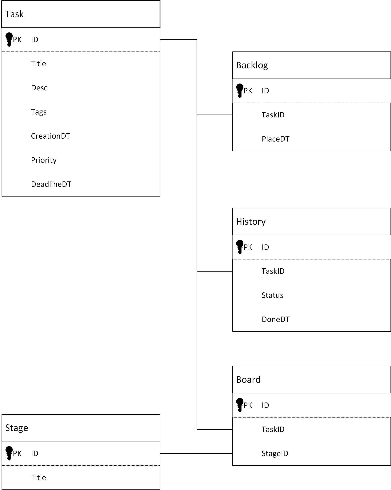

## Модель данных (ER-диаграмма)

### Описание основных сущностей

---

#### **Task (Задача)**
Это основная сущность системы, отражающая отдельную задачу, которую пользователь ставит перед собой. Каждая задача содержит все сведения, необходимые для её идентификации, детализации и последующего отслеживания.

**Атрибуты:**
- `ID` — уникальный идентификатор задачи (первичный ключ)
- `Title` — название задачи
- `Desc` — подробное описание задачи
- `Tags` — список тегов, связанных с задачей
- `CreationDT` — дата и время создания задачи
- `Priority` — приоритет задачи
- `DeadLineDT` — дата и время, когда задача должна быть завершена

---

#### **Stage (Стадия)**
Используется для объединения задач по определённым стадиям выполнения в рамках рабочего процесса. Каждая стадия отражает конкретное состояние задачи на Kanban-доске (например, «К выполнению», «В работе», «Выполнено»), что облегчает визуальное управление и навигацию по задачам.

**Атрибуты:**
- `ID` — уникальный идентификатор стадии
- `Title` — название стадии

---

#### **Backlog (Бэклог)**
Служит для хранения задач, которые пользователь планирует выполнить в будущем. Это своеобразный резерв задач, которые пока не выведены на основную доску и не имеют активного статуса выполнения.

**Атрибуты:**
- `ID` — уникальный идентификатор записи
- `TaskID` — идентификатор задачи, добавленной в бэклог
- `PlaceDT` — дата и время помещения задачи в бэклог

---

#### **History (История)**
Фиксирует все изменения статусов задач во времени. Это позволяет отследить всю историю переходов задачи по стадиям, что важно для анализа продуктивности и выявления «узких мест» в рабочем процессе.

**Атрибуты:**
- `ID` — уникальный идентификатор записи
- `TaskID` — идентификатор задачи, для которой сохраняется история
- `Status` — статус задачи на определённый момент времени
- `DoneDT` — дата и время присвоения статуса

---

#### **Board (Доска)**
Отражает текущее расположение задачи на Kanban-доске, а также дополнительную информацию о её сроках и приоритете. Эта сущность позволяет видеть, в каком статусе и в какой группе находится каждая задача прямо сейчас.

**Атрибуты:**
- `ID` — уникальный идентификатор записи
- `TaskID` — идентификатор задачи
- `GroupID` — идентификатор группы, к которой относится задача
- `Status` — текущий статус задачи

---

### Взаимосвязи между сущностями

- `Task` может быть включена в `Backlog` и на `Board`; одна задача может иметь множество исторических записей (`History`).
- `Board` связывает задачи (`TaskID`) и группы (`StageID`), определяя текущее положение задачи на доске.
- `History` и `Backlog` ссылаются на `Task` по идентификатору (`TaskID`), обеспечивая сохранение истории изменений и управление резервом задач.
- `Stage` используется для объединения задач по стадиям на доске (`Board`), позволяя структурировать рабочее пространство пользователя.
