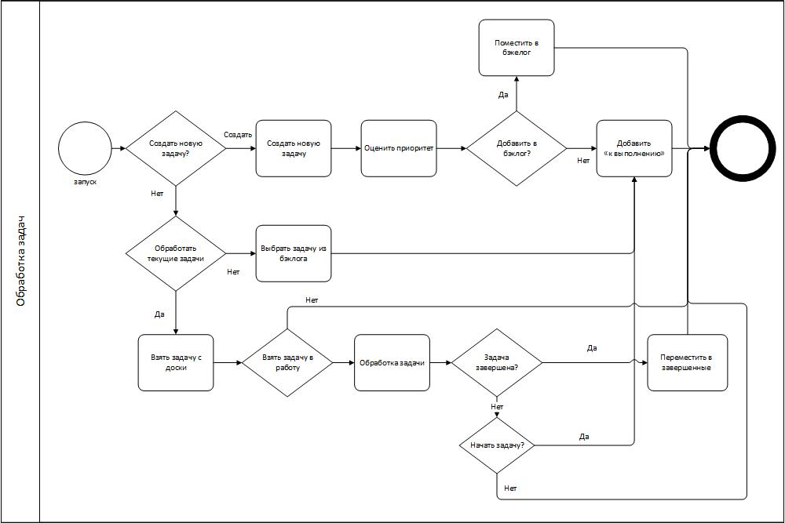
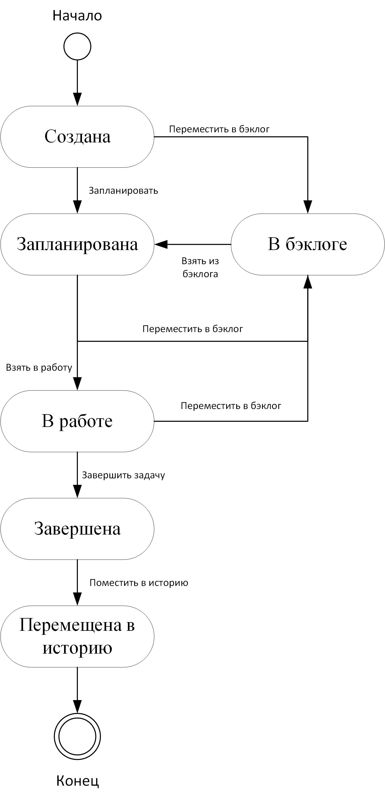
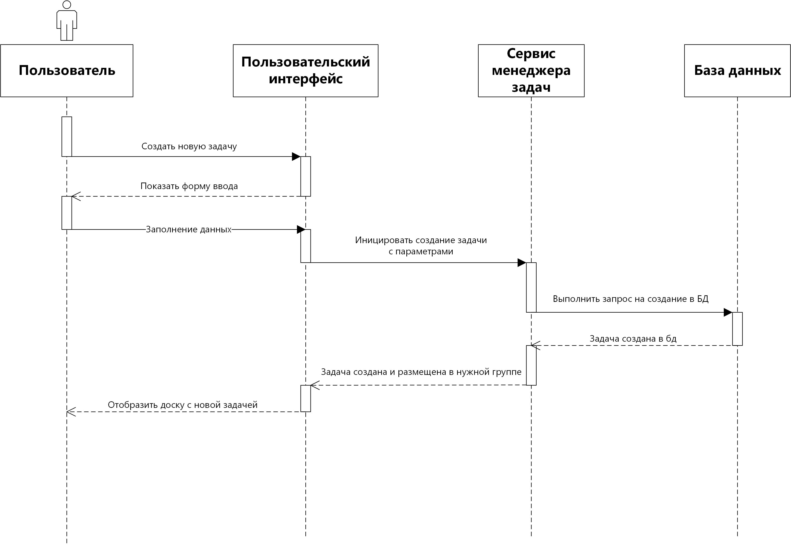
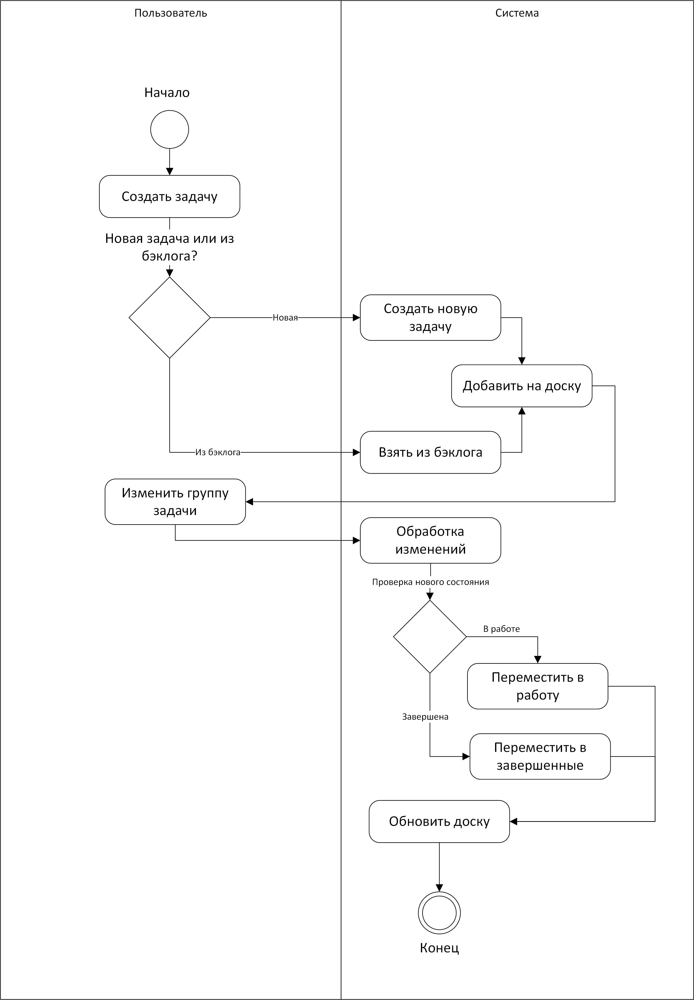

# Модель бизнес-процессов

На блок-схеме отражаются ключевые процессы управления задачами: создание, постановка в бэклог, обработка на доске, выполнение и завершение.

### Описание бизнес-процесса

- **Запуск процесса** — бизнес-процесс начинается с момента инициализации приложения или старта сессии пользователя.
- **Создание новой задачи** — пользователь может выбрать создание новой задачи. После формирования задачи определяется её приоритет и принимается решение: добавить задачу сразу в текущие задачи (стадия "к выполнению") или отправить в бэклог для последующей обработки.
- **Выбор и обработка задач** — если новая задача не создаётся, пользователь может приступить к обработке текущих задач, находящихся на доске, либо выбрать задачу из бэклога и перевести её в стадию "к выполнению".
- **Работа с задачей на доске** — на этом этапе осуществляется цикл обработки задач: задача может быть взята в работу. В процессе обработки задачи регулярно проверяется её стадия: завершена ли задача или требует дальнейших действий. Если задача завершена — она переводится в стадию завершённых. Если задача не завершена, принимается решение — начать обработку заново или отложить (вернуть в исходный статус для последующей доработки).
- **Завершение процесса** — процесс обработки задачи завершается, когда задача либо полностью выполнена и перемещена в раздел завершённых, либо возвращена в бэклог/ожидает доработки.

Далее пользователь может приступить к следующей задаче, повторяя цикл.

**Краткие пояснения к основным элементам схемы:**
- **Бэклог** — хранилище всех задач, не отобранных для выполнения прямо сейчас.
- **Текущие задачи ("к выполнению")** — задачи, которые отобраны из бэклога или созданы с высоким приоритетом и находятся в работе.
- **Завершённые задачи** — задачи, по которым полностью завершён цикл выполнения.
- **Циклический характер процесса** — отражает возможность многократного возврата задачи на доработку, что соответствует практике гибких методологий управления проектами (Agile/Kanban).

---

## Диаграмма состояний задачи

- **Начало → Создана.** После инициализации процесса новая задача попадает в состояние «Создана» — стартовая точка жизненного цикла задачи, когда она только добавлена в систему и еще не распределена.
- **Создана → В бэклог.** Если задача пока не требует немедленного выполнения, она помещается в бэклог. Переход осуществляется действием «Переместить в бэклог». В этом состоянии задача ожидает своего времени для планирования.
- **Создана → Запланирована.** Если задачу сразу необходимо включить в план работ, осуществляется переход «Запланировать». В этом случае задача становится запланированной, минуя бэклог.
- **В бэклоге → Запланирована.** Когда задача из бэклога выбирается для выполнения в ближайший рабочий период, осуществляется переход «Взять из бэклога». Теперь задача считается запланированной.
- **Запланирована → В бэклог.** Если по каким-то причинам задача, уже включённая в план, откладывается, она возвращается обратно в бэклог действием «Переместить в бэклог».
- **Запланирована → В работе.** Когда исполнитель приступает к выполнению задачи, совершается переход «Взять в работу». Задача считается находящейся в работе.
- **В работе → В бэклог.** Если в процессе выполнения возникает необходимость временно отложить задачу (например, из-за изменений приоритетов или недостатка информации), она возвращается в бэклог через переход «Переместить в бэклог».
- **В работе → Завершена.** После выполнения всех необходимых действий задача переводится в состояние «Завершена» переходом «Завершить задачу».
- **Завершена → Перемещена в историю.** Когда задача больше не актуальна и требуется её архивировать, используется переход «Поместить в историю». Задача перемещается в архив, где хранится для истории и статистики.
- **Перемещена в историю → Конец.** Архивированная задача считается завершённой, жизненный цикл задачи оканчивается.

---

## Диаграмма взаимодействий

Диаграмма отражает ключевой сценарий использования персонального Agile-планировщика — создание новой задачи пользователем.

**Описание сценария:**
- Пользователь инициирует создание новой задачи через пользовательский интерфейс приложения.
- Интерфейс отображает форму ввода, где пользователь заполняет параметры задачи: название, описание, приоритет, группу и другие атрибуты.
- После заполнения пользователь подтверждает действие, данные отправляются системе.
- Интерфейс передаёт данные сервису менеджера задач, который отвечает за бизнес-логику создания задачи, проверяет корректность данных и формирует запрос на добавление задачи в базу данных.
- После успешного выполнения запроса база данных подтверждает создание записи.
- Сервис менеджера задач уведомляет пользовательский интерфейс о результате, и интерфейс обновляет отображение доски задач, добавляя новую задачу в нужную группу.
- Пользователь видит актуальное состояние доски с новой задачей.

---

## Диаграмма активности

На диаграмме представлены основные этапы жизненного цикла задачи:

- Пользователь может добавить новую задачу или выбрать существующую из бэклога.
- После создания задача добавляется на доску.
- Возможна смена группы задачи (например, перетаскивание между колонками).
- При изменении состояния задачи система проверяет, переведена ли задача "в работу" или "завершена", и соответственно перемещает её по доске.
- После всех операций доска обновляется, процесс завершается.

Диаграмма построена с использованием двух **swimlane** ("Пользователь" и "Система"), что наглядно показывает зоны ответственности и автоматизации.
