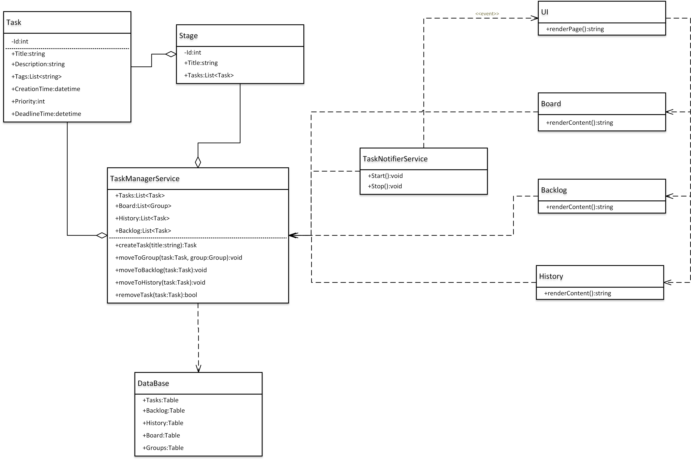

## Диаграмма классов

Диаграмма классов отражает архитектуру информационной системы планировщика задач в соответствии с принципами микросервисной архитектуры. На диаграмме выделены основные сущности системы, их атрибуты, основные методы и связи между объектами.

### Основные классы и их описание

- **Task**  
  Основной бизнес-объект, описывающий отдельную задачу.  
  Атрибуты: идентификатор, заголовок, описание, список тегов, время создания, приоритет, время завершения.

- **Stage**  
  Контейнер для задач. Каждая стадия характеризуется идентификатором, названием и списком задач, которые к ней относятся.

- **TaskManagerService**  
  Центральный сервис, управляющий всеми задачами, группами, историей изменений и бэклогом.  
  В сервисе реализованы методы для создания задач, перемещения задач между стадиями и бэклогом, работы с историей изменений, удаления задач.  
  Агрегирует коллекции задач, стадий, истории и бэклог, отвечает за бизнес-логику по управлению данными.

- **TaskNotifierService**  
  Сервис уведомлений и напоминаний. Получает информацию о задачах от TaskManagerService и используется для отправки событий и уведомлений в пользовательский интерфейс (UI).

- **DataBase**  
  Абстракция слоя хранения данных.  
  Представляет таблицы для хранения задач, стадий, доски, бэклога и истории изменений.  
  Все операции сохранения и извлечения данных осуществляются через TaskManagerService.

- **UI**  
  Пользовательский интерфейс системы. Получает данные исключительно через TaskManagerService и реагирует на события, отправляемые TaskNotifierService.  
  Основной метод UI — генерация HTML-страницы (`renderPage()`).

- **Board, Backlog и History**  
  Компоненты для визуализации соответствующих частей системы в пользовательском интерфейсе.  
  Каждый компонент реализует собственный метод `renderContent()`, отвечающий за формирование HTML-содержимого для вывода в UI.

---

Связи между классами организованы таким образом, чтобы исключить прямой доступ пользовательского интерфейса или вспомогательных сервисов к данным.  
Все взаимодействие с задачами, группами, историей и бэклогом происходит только через `TaskManagerService`.  
Сервис уведомлений (`TaskNotifierService`) получает доступ к данным через `TaskManagerService` и уведомляет UI о важных событиях.  
`TaskManagerService` взаимодействует с базой данных напрямую, что обеспечивает централизованный и безопасный доступ к данным.
