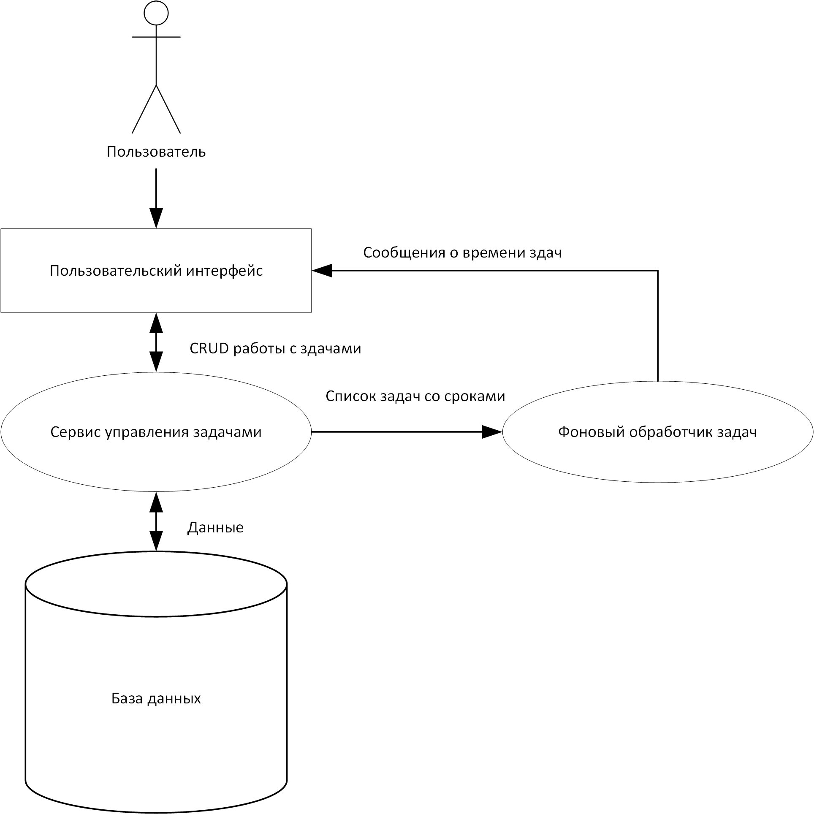

## Архитектурная схема системы

### Ключевые компоненты системы, их взаимодействие и назначение

1. **Пользователь**
   - Является инициатором всех действий в системе.
   - Формирует задачи, устанавливает сроки, отслеживает статусы выполнения через пользовательский интерфейс.
   - Осуществляет взаимодействие только с пользовательским интерфейсом.

2. **Пользовательский интерфейс (UI)**
   - Обеспечивает визуализацию задач, статусов и сроков.
   - Принимает команды пользователя (создание, изменение, удаление задач).
   - Показывает уведомления и напоминания, поступающие от фонового обработчика.
   - Взаимодействует с пользователем, передает запросы на операции с задачами сервису управления задачами.
   - Получает сообщения о времени задач (уведомления о дедлайнах) от фонового обработчика задач.

3. **Сервис управления задачами**
   - Реализует бизнес-логику работы с задачами.
   - Обрабатывает CRUD-операции (создание, чтение, обновление, удаление задач).
   - Формирует и передает списки задач по запросу фонового обработчика.
   - Взаимодействует с базой данных для хранения и получения данных.
   - Получает команды на изменение задач от пользовательского интерфейса.
   - Передает и получает данные из базы данных.
   - Предоставляет список задач с дедлайнами фоновому обработчику задач.

4. **Фоновый обработчик задач**
   - Периодически анализирует задачи и сроки их выполнения.
   - Отслеживает приближение или наступление дедлайнов.
   - Формирует сообщения о времени задач (напоминания, уведомления о просрочке).
   - Обеспечивает своевременное информирование пользователя о критических сроках выполнения задач.
   - Получает список задач со сроками от сервиса управления задачами.
   - Отправляет сообщения и уведомления о времени задач в пользовательский интерфейс.

5. **База данных**
   - Хранит все сведения о задачах, сроках, тегах и прочих связанных данных.
   - Обеспечивает целостность, безопасность и сохранность информации.
   - Взаимодействует с сервисом управления задачами, поддерживает выполнение всех необходимых операций с данными.
