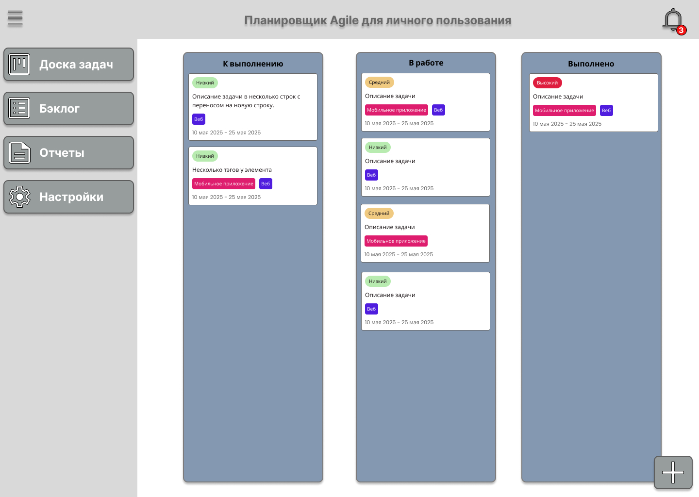

## Интерфейс пользователя

В верхней части экрана размещён заголовок приложения — **«Планировщик Agile для личного пользования»**. Он выполнен крупным шрифтом, расположен по центру, что сразу определяет назначение и стиль системы.

Справа от заголовка находится иконка уведомлений с индикатором (красный кружок с числом новых уведомлений).

Слева реализовано вертикальное меню с кнопками, каждая из которых имеет иконку и подпись:
- **Доска задач** — переход к Kanban-доске (текущий активный раздел).
- **Бэклог** — список всех задач вне текущей доски (хранение идей, новых задач и т.д.).
- **Отчёты** — раздел для аналитики и просмотра статистики по задачам и проектам.
- **Настройки** — параметры пользователя и приложения.

В левом верхнем углу находится «гамбургер»-меню для сворачивания/разворачивания бокового меню. Меню выполнено в стиле выпадающей панели и позволяет быстро перемещаться по основным разделам системы.

Вся центральная часть экрана занята Kanban-доской, которая разделена на три колонки:
- **К выполнению** — задачи, которые только предстоит выполнить.
- **В работе** — задачи, над которыми сейчас ведётся работа.
- **Выполнено** — завершённые задачи.

Каждая колонка визуально отделена, имеет отдельный цветовой заголовок. Внутри каждой колонки размещены карточки задач со следующим содержанием:
- **Метка приоритета** — сверху карточки цветной ярлык:
    - зелёный (Низкий),
    - жёлтый (Средний),
    - красный (Высокий);
- **Описание задачи** — текст задачи, который может содержать переносы строк;
- **Теги** — под описанием располагаются цветные метки-теги, которые отражают тип задачи (например, «Мобильное приложение», «Веб» и др.);
- **Даты** — внизу карточки указан срок выполнения (диапазон дат: начало — окончание).

Внизу справа размещена плавающая кнопка («+») для создания новой задачи или элемента. Кнопка выделена, чтобы пользователь мог быстро добавить новую задачу из любого состояния.
